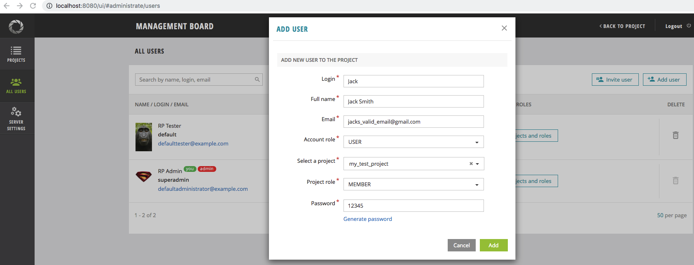
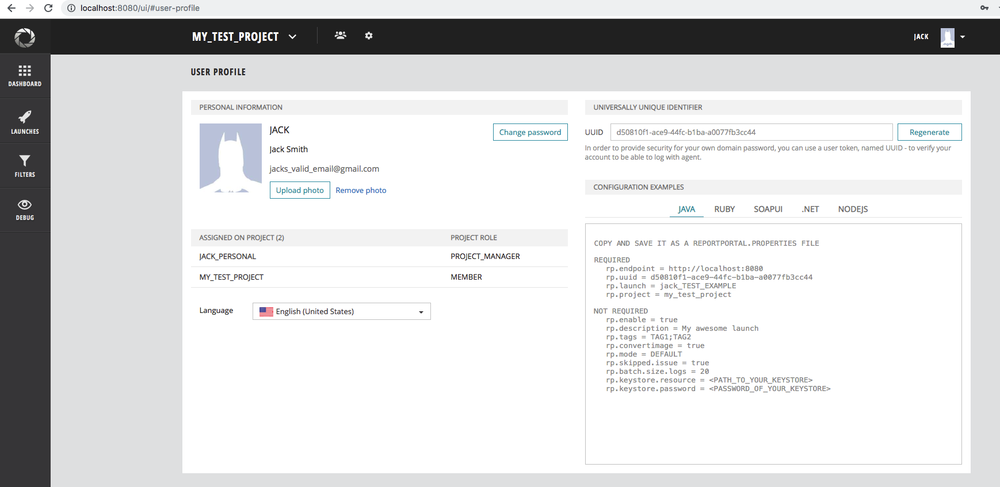
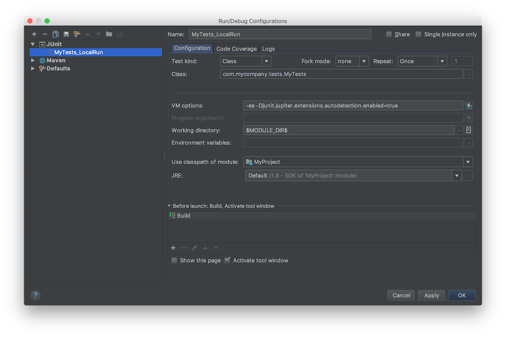
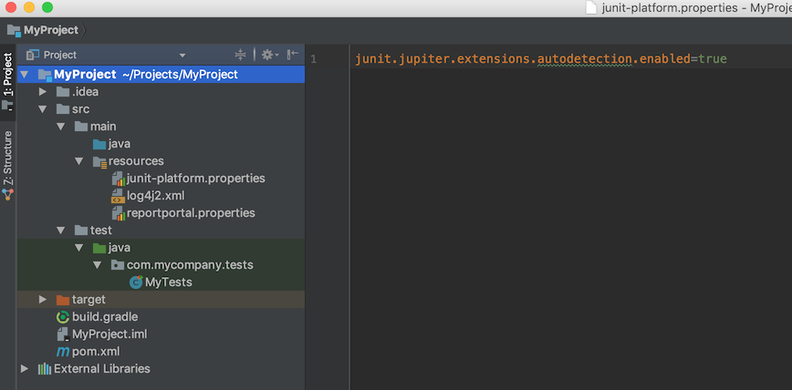

# agent-java-junit5

[  ](https://bintray.com/epam/reportportal/agent-java-junit5/_latestVersion)
[](https://reportportal-slack-auto.herokuapp.com)
[](http://stackoverflow.com/questions/tagged/reportportal)
[](https://rpp.uservoice.com/forums/247117-report-portal)
[](http://reportportal.io?style=flat)
---
# ReportPortal [JUnit5](https://junit.org/junit5/) Integration

The repository contains [JUnit5 Extension](https://junit.org/junit5/docs/current/user-guide/#extensions) for [ReportPortal](http://reportportal.io/) integration.

## Getting Started

1. Create folders **_/META-INF/services_** in **_resources_**
2. Put there a file named **_org.junit.jupiter.api.extension.Extension_**
3. Supply a single row **_com.epam.reportportal.junit5.ReportPortalExtension_** for default implementation

__/META-INF/services/org.junit.jupiter.api.extension.Extension__
```xml
com.epam.reportportal.junit5.ReportPortalExtension
```

If you desire to configure test *name*, *description* and *tags*:

Extend *ReportPortalExtension*, override *getTestItem()* and replace *com.epam.reportportal.junit5.ReportPortalExtension*
with fully qualified custom Extension class name in this file.

### Maven

```xml
<repositories>
    <repository>
        <id>bintray</id>
        <url>http://dl.bintray.com/epam/reportportal</url>
    </repository>
</repositories>

<dependency>
   <groupId>com.epam.reportportal</groupId>
   <artifactId>agent-java-junit5</artifactId>
   <version>5.0.0-RC-1</version>
</dependency>
```

#### Automatic Extension Registration (optional)

```xml
<build>
    <plugins>
        <plugin>
            <artifactId>maven-surefire-plugin</artifactId>
            <version>2.22.0</version>
            <configuration>
                <properties>
                    <configurationParameters>
                        junit.jupiter.extensions.autodetection.enabled = true
                    </configurationParameters>
                </properties>
            </configuration>
        </plugin>
    </plugins>
</build>
```

### Gradle

```groovy
repositories {
    jcenter()
    mavenLocal()
    maven { url "http://dl.bintray.com/epam/reportportal" }
}

testCompile 'com.epam.reportportal:agent-java-junit5:5.0.0-RC-1'
```

#### Automatic Extension Registration (optional)

```groovy
test {
    useJUnitPlatform()
    systemProperty 'junit.jupiter.extensions.autodetection.enabled', true
}
```

## Disabled tests reporting
By default reporting of @Disabled tests is switched off. To switch it on - add next parameter to an execution goal:
- Maven: -DreportDisabledTests=true
- Gradle: -PreportDisabledTests=true 

# Step-by-step integration manual for JUnit5

This manual will walk you through the steps for integration of Report Portal with JUnit5 based project

First, make sure you have installed Report Portal, the installation steps could be found [here](http://reportportal.io/docs/Installation-steps)

We’ll assume that Report Portal is installed and running on <http://localhost:8080>

## Step 1 - Create new project (Maven)

> If you want to integrate Report Portal with existing project, go to step 2

#### 1.1 Start new maven project


#### 1.2 Enter GroupId and ArtifactId


#### 1.3 Enter project name


## Step 2 - Configure pom.xml

#### 2.1 Add following repositories:

```xml
<repositories>
    <repository>
        <id>bintray</id>
        <url>http://dl.bintray.com/epam/reportportal</url>
    </repository>
</repositories>
```

#### 2.2 Add following dependencies:

*Report Portal agent implementation for JUnit 5*
```xml
<dependency>
    <groupId>com.epam.reportportal</groupId>
    <artifactId>agent-java-junit5</artifactId>
    <version>5.0.0-RC-1</version>
</dependency>
```
> Latest version of the agent, could be found [here](https://bintray.com/epam/reportportal/agent-java-junit5)


The Report Portal agent for JUnit 5 includes the JUnit 5 library dependency, and so we won't need other explicit JUnit 5 dependencies  
However, if you are adding Report Portal agent to existing project, with JUnit 5 dependency already declared, pay attention to dependency transitivity and the conflicts that might arise

> More about JUnit 5 dependencies structure could be found [here](https://junit.org/junit5/docs/current/user-guide/#dependency-metadata)

#### 2.3 Add Report Portal dedicated logger wrapper
Report Portal provides it's own logger implementation for major logging frameworks like *log4j* and *logback*

If you prefer using **Logback** logging library, add following dependencies:

*ReportPortal logback logger dependency*
```xml
<dependency>
    <groupId>com.epam.reportportal</groupId>
    <artifactId>logger-java-logback</artifactId>
    <version>5.0.2</version>
</dependency>
```
> Up to date version could be found [here](https://bintray.com/epam/reportportal/logger-java-logback)

*The logback itself*
```xml
<dependency>
    <groupId>ch.qos.logback</groupId>
    <artifactId>logback-classic</artifactId>
    <version>1.2.3</version>
</dependency>
```

If you prefer using **Log4j** logging library, add following dependencies:

*ReportPortal log4j logger dependency*
```xml
<dependency>
    <groupId>com.epam.reportportal</groupId>
    <artifactId>logger-java-log4j</artifactId>
    <version>5.0.2</version>
</dependency>
```
> Up to date version could be found [here](https://bintray.com/epam/reportportal/logger-java-log4j)

*The log4j itself*
```xml
<dependency>
    <groupId>org.apache.logging.log4j</groupId>
    <artifactId>log4j-api</artifactId>
    <version>2.11.2</version>
</dependency>

<dependency>
     <groupId>org.apache.logging.log4j</groupId>
     <artifactId>log4j-core</artifactId>
     <version>2.11.2</version>
</dependency>
```

## Step 3 - Add the test with logging

#### 3.1 Add simple test method

Create a test class `MyTests` in the test directory and add JUnit 5 test method there

```java
package com.mycompany.tests;

import org.apache.logging.log4j.LogManager;
import org.apache.logging.log4j.Logger;
import org.junit.jupiter.api.*;

public class MyTests {

    private static final Logger LOGGER = LogManager.getLogger(MyTests.class);

    @Test
    void testMySimpleTest() {
        LOGGER.info("Hello from my simple test");
    }
}
```

#### 3.2 Add `log4j2.xml` file to `resources` folder
*Example:*
```xml
<?xml version="1.0" encoding="UTF-8"?>
<Configuration status="WARN">
    <Appenders>
        <Console name="ConsoleAppender" target="SYSTEM_OUT">
            <PatternLayout
                    pattern="%d [%t] %-5level %logger{36} - %msg%n%throwable"/>
        </Console>
        <ReportPortalLog4j2Appender name="ReportPortalAppender">
            <PatternLayout
                    pattern="%d [%t] %-5level %logger{36} - %msg%n%throwable"/>
        </ReportPortalLog4j2Appender>
    </Appenders>
    <Loggers>
        <Root level="DEBUG">
            <AppenderRef ref="ConsoleAppender"/>
            <AppenderRef ref="ReportPortalAppender"/>
        </Root>
    </Loggers>
</Configuration>
```
It's needed to add `ReportPortalAppender` into this (as shown in the example)

By this moment, your project tree should look somewhat like the this:


## Step 4 - Configuring ReportPortal

#### 4.1 Open ReportPortal UI

Go to *http:$IP_ADDRESS_OF_REPORT_PORTAL:8080* (by default it is *http://localhost:8080*)

Login as **Admin** user and create the project (more details [here](http://reportportal.io/docs/Deploy-ReportPortal) and [here](http://reportportal.io/docs/Creation-of-project))


#### 4.2 Add users to your project:

Go to *Administrative* -> *My Test Project* -> *Members* -> *Add user*
> Example link *http://localhost:8080/ui/#administrate/project-details/my_test_project/members*



## Step 5 - Link ReportPortal with your tests

#### 5.1 - Add `reportportal.properties`

After you have created new user in your project, you can get `reportportal.properties` file example from the user *Profile* page

To do that, login as created user and go to *User icon* in header -> *Profile*

There, in *Configuration Examples* section, you can find the example of `reportportal.properties` file for that user



Returning back to the code. In your project, create file named `reportportal.properties` in `resources` folder and copy&paste the contents form the user profile page

*Example:*
```properties
[reportportal.properties]
rp.endpoint = http://localhost:8080
rp.uuid = d50810f1-ace9-44fc-b1ba-a0077fb3cc44
rp.launch = jack_TEST_EXAMPLE
rp.project = my_test_project
rp.enable = true
```

> More details on `reportportal.properties` file could be found [here](http://reportportal.io/docs/JVM-based-clients-configuration)

#### 5.2 - Register Report Portal agent in JUnit 5
There are two options how you can enable ReportPortal extension in your tests:
- By specifying `@ExtendWith` annotation
- By service location

##### Register ReportPortal extension with annotation
Each test marked with `@ExtendWith(ReportPortalExtension.class)` will be reporter to ReportPortal.
This is an inheritable annotation, that means you can put it on a superclass and all child classes will
also use a specified extension.

For example:  
```java
import com.epam.reportportal.junit5.ReportPortalExtension;
import org.junit.jupiter.api.extension.ExtendWith;
import org.junit.jupiter.params.ParameterizedTest;
import org.junit.jupiter.params.provider.EnumSource;

@ExtendWith(ReportPortalExtension.class)
public class EnumParametersTest {

	public enum TestParams {
		ONE,
		TWO
	}

	@ParameterizedTest
	@EnumSource(TestParams.class)
	public void testParameters(TestParams param) {
		System.out.println("Test: " + param.name());
	}

}
```

##### Register ReportPortal extension through service location
For those who implement their own custom extensions we decided to remove `/META-INF/services` file from our project.
To use our standard non-custom extension you need to add this file into your project by yourself.
To do that create a file named `org.junit.jupiter.api.extension.Extension` in `src/test/resources/META-INF/services` folder
with the following content:
```text
com.epam.reportportal.junit5.ReportPortalExtension
```

As a final step you need to tell JUnit to register our Report Portal agent, and there are multiple ways for doing that:

* method 1 - via Maven Surefire/Failsafe plugin (maven only)
* method 2 - via JVM system property
* method 3 - via `junit-platform.properties` file
* method 4 - via Gradle (gradle only)

###### Method 1 - using Maven Surefire/Failsafe plugin (maven only)

Add a `build` section and Maven Surefire plugin with the following configuration section to `pom.xml`

```xml
<build>
    <plugins>
        <plugin>
            <artifactId>maven-surefire-plugin</artifactId>
            <version>2.22.0</version>
            <configuration>
                <properties>
                    <configurationParameters>
                        junit.jupiter.extensions.autodetection.enabled = true
                    </configurationParameters>
                </properties>
            </configuration>
        </plugin>
    </plugins>
</build>
```
The `junit.jupiter.extensions.autodetection.enabled = true` configuration parameter of the Surefire plugin links Report Portal agent with the tests

*Full pom.xml file example*

```xml
[pom.xml]
<?xml version="1.0" encoding="UTF-8"?>
<project xmlns="http://maven.apache.org/POM/4.0.0"
         xmlns:xsi="http://www.w3.org/2001/XMLSchema-instance"
         xsi:schemaLocation="http://maven.apache.org/POM/4.0.0 http://maven.apache.org/xsd/maven-4.0.0.xsd">
    <modelVersion>4.0.0</modelVersion>

    <groupId>com.mycompany</groupId>
    <artifactId>MyProject</artifactId>
    <version>1.0-SNAPSHOT</version>

    <repositories>
        <repository>
            <id>bintray</id>
            <url>http://dl.bintray.com/epam/reportportal</url>
        </repository>
    </repositories>

    <dependencies>
        <dependency>
            <groupId>com.epam.reportportal</groupId>
            <artifactId>agent-java-junit5</artifactId>
            <version>5.0.0-RC-1</version>
        </dependency>

        <dependency>
            <groupId>com.epam.reportportal</groupId>
            <artifactId>logger-java-log4j</artifactId>
            <version>5.0.2</version>
        </dependency>

        <dependency>
            <groupId>org.apache.logging.log4j</groupId>
            <artifactId>log4j-api</artifactId>
            <version>2.11.2</version>
        </dependency>

        <dependency>
            <groupId>org.apache.logging.log4j</groupId>
            <artifactId>log4j-core</artifactId>
            <version>2.11.2</version>
        </dependency>

    </dependencies>

    <build>
        <plugins>
            <plugin>
                <artifactId>maven-surefire-plugin</artifactId>
                <version>2.22.0</version>
                <configuration>
                    <properties>
                        <configurationParameters>
                            junit.jupiter.extensions.autodetection.enabled = true
                        </configurationParameters>
                    </properties>
                </configuration>
            </plugin>
        </plugins>
    </build>

</project>
```

Now the Report Portal agent is linked to your tests and when you run the tests with maven, the results should be sent to Report Portal

> *Important note*. With this approach, only the tests executed via maven will be sent to Report Portal, while tests ran by IDE will not trigger the Report Portal agent and therefore the test-report won't be generated  

To have test results to be sent to Report Portal when executed from IDE (without maven), follow the steps below

###### Method 2 - using JVM system property  

Another way to link test runs with Report Portal is to add JVM system property to the run arguments for test runs  
Here is the example of adding run arguments with IntelliJ IDEA  

In Intellij IDEA go to *Run* -> *Edit Configurations* -> click on "+" sign -> select JUnit




Enter the name of the run, select classes and/or methods to be executed in this configuration and add the following line into *VM Options* field:
```shell
-Djunit.jupiter.extensions.autodetection.enabled=true
```

When you are done adding local run configuration, simply go to *Run* -> *Run <test_run_name>* and that test run results should be sent to Report Portal

###### Method 3 - using `junit-platform.properties` file

There is another option of linking Report Portal with your JUnit 5 tests

Add `junit-platform.properties` file to your `resources` folder and add the following line there:

```shell
junit.jupiter.extensions.autodetection.enabled=true
```



> More details about JUnit 5 extensions detection configuration could be found [here](https://junit.org/junit5/docs/current/user-guide/#extensions-registration-automatic)

With this approach, the test report will be generated and sent to Report Portal in any type of test run, whether it was via maven, gradle or via IDE

###### Method 4 - using Gradle test task (Gradle only)

Starting from gradle version `4.6` it provides native support for JUnit 5 tests via `useJUnitPlatform()`, more details [here](https://junit.org/junit5/docs/current/user-guide/#running-tests-build)

Assuming that you have the gradle project setup, add/edit your `test` task in `gradle.build` file with the following code:

```gradle
test {
    testLogging.showStandardStreams = true
    useJUnitPlatform()
    systemProperty 'junit.jupiter.extensions.autodetection.enabled', true
}
```

> Please note, that using this method, the test report will be generated only if you ran your tests with Gradle (e.g. `gradle clean test`)

*Full `build.gradle` file example:*

```groovy
[build.gradle]
apply plugin: 'java'
sourceCompatibility = 1.8
targetCompatibility = 1.8

repositories {
    mavenLocal()
    mavenCentral()
    jcenter()
    maven { url "http://dl.bintray.com/epam/reportportal" }
}

dependencies {
    compile 'com.epam.reportportal:logger-java-log4j:5.0.2'
    compile 'org.apache.logging.log4j:log4j-api:2.11.2'
    compile 'org.apache.logging.log4j:log4j-core:2.11.2'
    compile 'com.epam.reportportal:agent-java-junit5:5.0.0-RC-1'
}

test {
    testLogging.showStandardStreams = true
    useJUnitPlatform()
    systemProperty 'junit.jupiter.extensions.autodetection.enabled', true
}
```

## Step 6 - Observing test run report

After you linked the Report Portal JUnit 5 agent using one of the approaches described above and ran your tests, you should be able to see the results in your ReportPortal UI instance  
To do that, login to ReportPortal, and go to *Left Panel* -> *Launches*

You should see the launch there, with the name equal to the value of `rp.launch` from your `reportportal.properties` file

*Example:*


You can also see the test classes and individual test results by clicking on the launch name and going deeper


# Copyright Notice

Licensed under the [Apache 2.0](https://www.apache.org/licenses/LICENSE-2.0) license (see the LICENSE.md file).